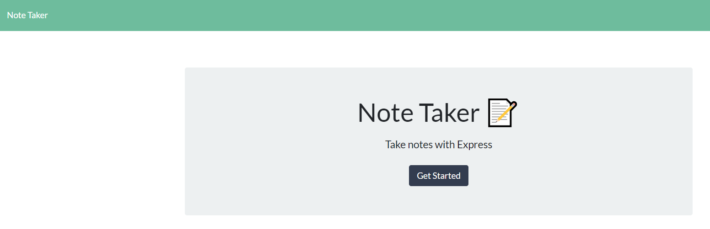

# Note Taker

 

This application stores and deletes notes for a business professional, like a sticky-note. 
The business professional has a lot of tasks, items, lists and otherwise to keep track of. This application stores all the sticky-notes that would clutter ones desk in a neat little application. 
       
## Table of Contents
        
- [Technologies](#technologies)
- [Installation](#installation)
- [Usage](#usage)
- [Credits](#credits)
- [License](#license)
- [Questions](#questions)

### Technologies
    
The technologies utilized in this application are as follows: express.js, express.router, and Heroku
- express was used because Express provides 'syntactic sugar' for writing server code and routes/
- Heroku was used because Heroku provides cloud based lauching of websites that use node.js. 

### Installation
    
To run this application successfully follow these steps:
1. Install [note_taker](https://github.com/JoannaTanveer/Notes/tree/master/Develop) to your local drive vis terminal/GitBash. This will install the package.json file which contains a list of all the dependencies for this application. 

2. Verify that node is installed in your computer by typing 'node' in the terminal/GitBash. If it returns
    >Welcome to Node.js v12.14.1. (or higher)
    >
    >Type ".help" for more information.
    
 Node.js is installed in your computer. If nothing happens or there is an error, visit [Node.js](https://nodejs.org/) and install the LTS version.
3. Type 'npm install' while in the terminal to install the dependencies. 

### Usage
    
The business professional has a lot of tasks, items, lists and otherwise to keep track of. This application stores all the sticky-notes that would clutter ones desk in a neat little application. , as mentioned above. Let's look a little further at how that can be accomplished.

    
### Credits
    
The Dev community prides itself in the open source culture that it celebrates and maintains. This application couldn't have been made possible without the help of
- Chris Zarlengo for his undefined. [Chris Zarlengo](https://github.com/Zarlengo)

    
#### Thank You!
    
    
### License
Licensed under the MIT license. 

### Questions
All questions and comments are welcome! Please contact me at joanna.tanveer@gmail.com or visit my [Github Profile](https://github.com/JoannaTanveer).
